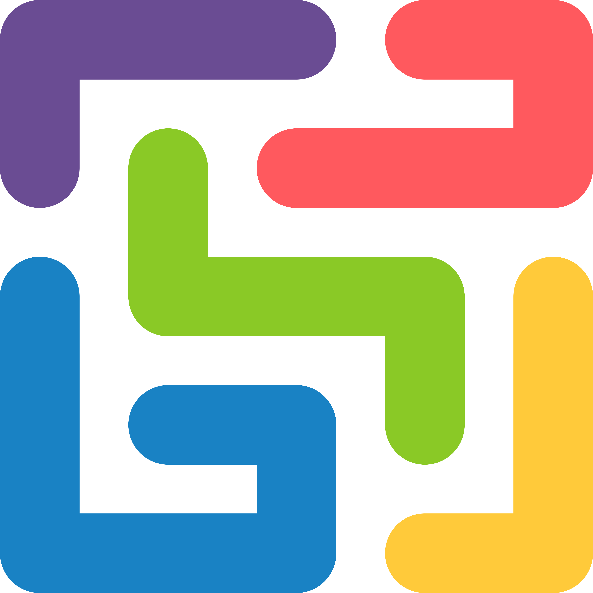

  

<h1 align="center">ALGO-TRON</h1>

Build a bot, send it onto the board over TCP, and outmaneuver other players' bots in a fast-paced Tron battle.

## Get started

Write a bot that survives on a wrapping board by avoiding trails and outlasting its opponents. Multiple boards run in parallel, and connected bots keep returning to matchmaking between games.

Start with the [Python example bots](example_bots/README.md). The [bot protocol](docs/bot-protocol.md) defines the TCP interface; [game mechanics](docs/game-mechanics.md) explains how to play. Use [versions](docs/accounts.md#independent-versions) to run different strategies under one account.

## Documentation

Follow the [bot guides](docs/README.md) from learning the rules to writing a strategy, debugging it, and keeping it online.

## Thanks

algo-tron is a Go reimplementation of [freehuntx/gpn-tron](https://github.com/freehuntx/gpn-tron). The bot protocol, the game idea, and the original event around it all come from there. Thanks to the gpn-tron author for the format. This is only possible thanks to the people I met at [gpn24](https://events.ccc.de/en/2026/03/15/gpn24/).
